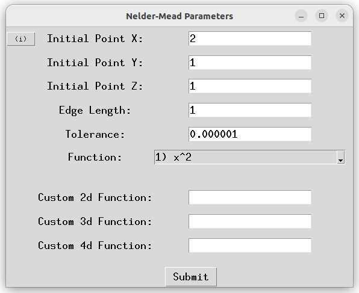
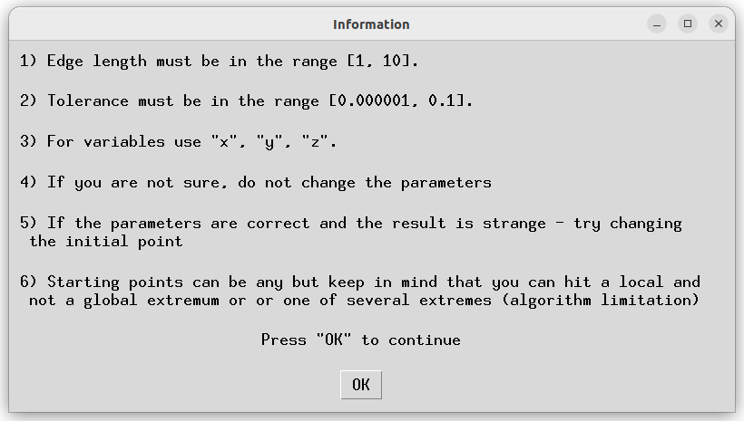
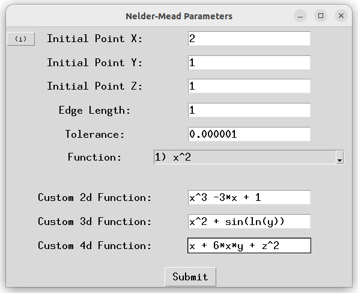
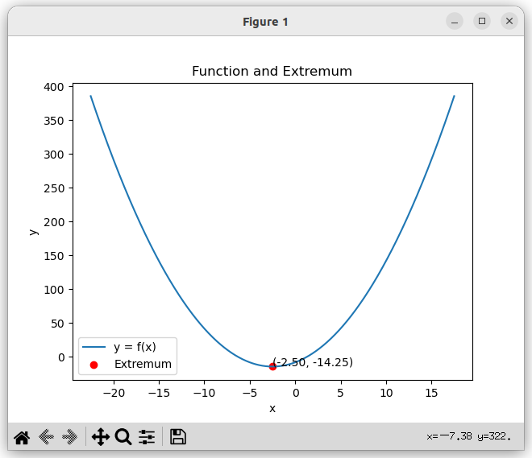
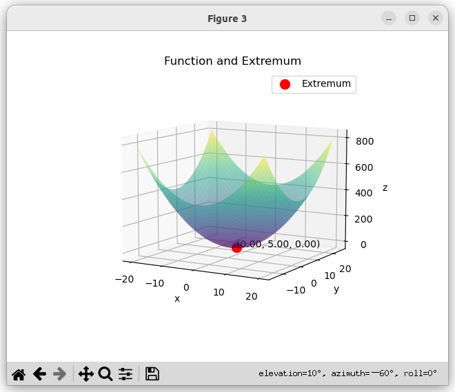
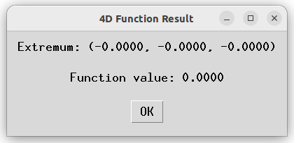
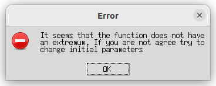

# Nelder-Mead method implementation

The project is an implementation of the Nelder-Mead method - "a numerical method used to find the minimum or maximum
of an objective function in a multidimensional space" (https://en.wikipedia.org/wiki/Nelder%E2%80%93Mead_method)
with the possibility for the user to enter his own functions of one, two or three variables.

# Table of Contents

- [Installation](#installation)
- [Requirements](#requirements)
- [Usage](#usage)
- [Testing](#testing)
- [Configuration](#configuration)
- [Authors and Contributors](#authors-and-contributors)
- [License](#license)

## Installation

To install this project, simply download the files and place them in the desired directory on your local machine.

You can download the files by cloning the repository:
```bash
git clone https://github.com/galieraf/NelderMead.git
```

## Requirements

- Python 3.1 or higher

This project requires the following libraries to be installed:

- numpy
- matplotlib
- sympy
- pytest
- pylint


Use the package manager [pip](https://pip.pypa.io/en/stable/) to install necessary libraries.
```bash
pip install -r requirements.txt
```
or
```bash
pip install numpy matplotlib sympy pytest pylint
```

## Usage
1. Clone or download this repository to your local machine.
2. Run the main script using the following command in your terminal:
```bash
python3 ./main.py
```

3. The GUI will open, and you can start using the application. 
Here are some basic instructions:
   
   - You will see the main program window where you can enter the necessary parameters.
   - 
   - You can set the starting point, the edge size, the allowable calculation inaccuracy,
   the initial edge size of the simplex. By clicking the info button in the upper left corner you can see
   the information about the parameters to be set. 
   - 
   
   - You can choose from several basic functions or enter your own function of one, two or three variables. 
   Please use variables x, x and y, x and y and z respectively. You can write using standard operations +, -, /, *, ^,
   you can use brackets (), constants e and pi, standard functions are also available: a/cos(x), a/sin(x), a/tan(x), ln(x), log(x).
   An example of a correctly entered function:
   - 
   - You can either select a function from the list or enter one custom. Click the "Submit" button to start the
   Nelder-Mead optimization process. If everything was successful, you will see the result.
   
   - The result for x^2 + 5x -8.
   - 
   
   - The result for x^2 + (y-5)^2. The graph can be rotated with the mouse.
   - 
   
   - the result for x^2 + y^2 + z^2. As you can see, there is no graphical representation here, 
because the projection of 4d on 2d is impossible
   - 
   - You can close the diagram and enter/choose new function that will be drawn on new diagram
   otherwise new ones will be drawn on the same diagram
   

4. !!!Important addition!!!
   - By default, the minimum of the function is searched. If you want to find the maximum of a function,
multiply it by -1. For example, to find the maximum of a f(x) = -x^2 - 5x function, enter x^2 + 5x.
Extremum point x coordinates will be the same.
   - If the function does not have an extremum or with some "lucky" parameters, we will wander around the extremum,
   but the required accuracy will not be performed. The program will loop or reach -infinity,
   then you will either see an error message. The timer for loop detection is set to 5 seconds. 
   You can change it if necessary.
   - 
   - Or you will get a strange graph:
   - .png)
   - This is the result fot f(x) = ln(x^2). The function does not have an extremum and at point 0 it is not defined at all.
   So you always better check it.
   - If you suddenly (God forbid) need to find the extremum of a function of 4 or more variables,
   you can use the function nelder_mead() from nelder_mead.py with your own parameters. But you will have to understand
   the code and the method a bit.
   

## Testing

You can launch tests from test_nelder_mead.py by this command.
```bash
pytest
```
Tests check the codestyle, significant part of the code and compare the result of the nelder_mead()
execution with the expected ones for different math functions. You can add your own tests.


For codestyle testing, I turned off the following warnings:

C0301 (line-too-long): I have chosen to disable this warning in my project because while I strive to keep my code
concise and readable, there are instances where lines of code need to exceed the default limit set by Pylint.
This is either due to the complexity of the statement being written, or because adhering to the line length limit would
otherwise reduce the readability and clarity of the code.

C0103 (invalid-name): This warning has been disabled because, in my code, there are several instances where
I've used variable names that are shorter than two characters for brevity and readability.
Moreover, I have certain naming conventions specific to this project that do not necessarily
align with the PEP 8 style guide but enhance the overall understanding and readability of my
code.

W0621 (redefined-outer-name): I've disabled this warning as in my test functions,
I've designed fixtures that have the same name as the outer function parameters.
This design choice is intentional, as it allows me to use PyTest's fixture injection
for test isolation and to ensure that each test has a fresh instance of the object under test.

R0913 (too-many-arguments): I have opted to disable this warning because,
in my project, there are functions that require more than the default five arguments.
The nature of these functions and the problem they are solving necessitates a larger number
of parameters. These arguments are essential for the function to perform its task and cannot
be reduced without hindering functionality. I have made sure that each argument is necessary,
and have documented their purpose thoroughly in the function's docstring to maintain readability and understandability.

## Configuration

Pull requests are welcome. For major changes, please open an issue first
to discuss what you would like to change.

Please make sure to update tests as appropriate.

## Authors and Contributors

Rafael Galiev(https://github.com/galieraf)

## License

[MIT](https://choosealicense.com/licenses/mit/)